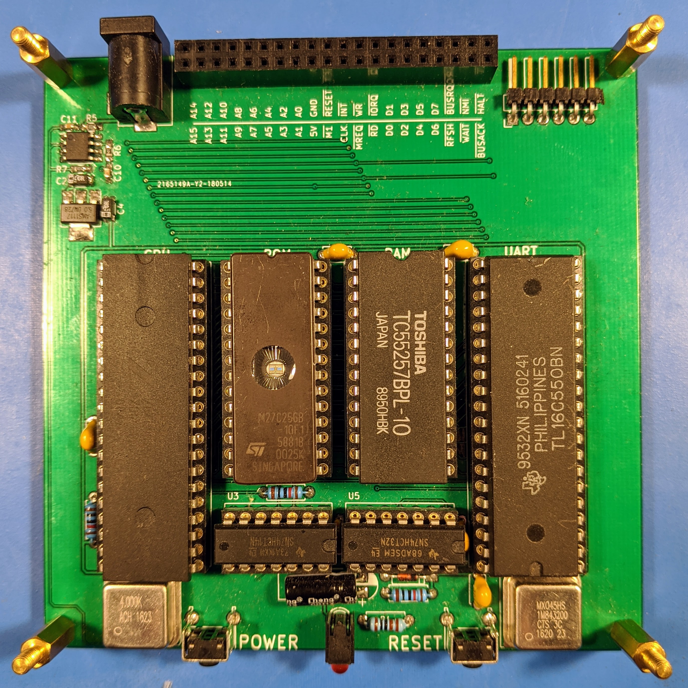

# z80

## Purpose

Back in collage we had a real time operating systems course with targetted the Motorola 68000 CPU. It was a great course but our target platform was an emulator and not real hardware. This left a gap in my knoweldge of how things like chip selection and peripherals were handled by the hardware. Therefore I decided to design and build a barebones 8-bit computer and this is the results.

## Memory Map

| Start | End | Description |
| --- | --- | --- |
| 0x0000 | 0x7FFF | ROM |
| 0x8000 | 0x0000 | RAM |

## IO Map

| Start | End | Description |
| --- | --- | --- |
| 0x80 | 0x87 | UART |
